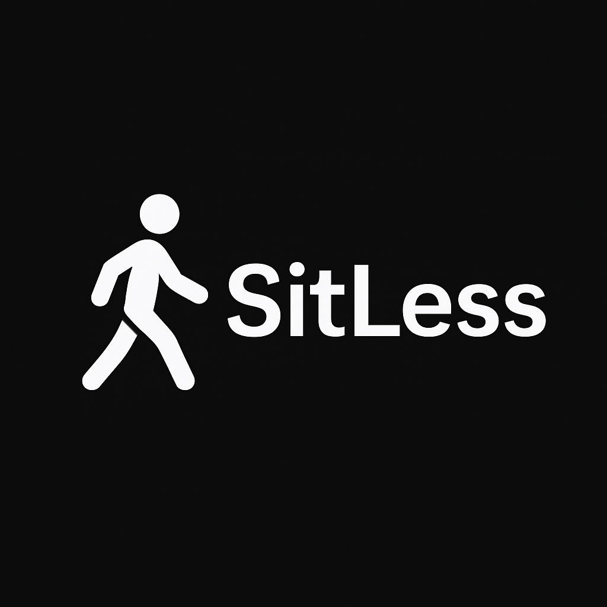

# SitLess

## Project Description

An application to help you get up in set intervals to help you stretch your legs
and help with circulation and get some fresh air.

## Technologies used

Built using Flask, HTML, CSS and Java. With some Jinja2 templating to help with consistency
between the different pages. 

## Getting Started

### Prerequisites

To run this project you will need to install the packages in the requirements.txt file.

### Usage

To run the application locally run the application.py file. Once the application starts
you will be able to access it locally at 'http://127.0.0.1:5000'. 